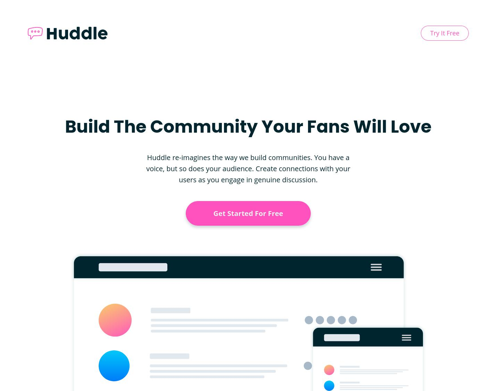

# Huddle Landing Page With Curved Section

<p align="left">
  
  
  <a href="https://twitter.com/vanzasetia" target="_blank"></a>
  
  
</p>
<p>
  <a href="http://jigsaw.w3.org/css-validator/check/referer">
    
    </a>
</p>

## Feedback and Live Review
* [🌍 Live Review](https://vanzahuddlecurved.netlify.app/)
* [👉 Give feedback on Frontend Mentor platform](https://www.frontendmentor.io/solutions/huddle-landing-page-with-curved-sections-html5-css3-sass-mailgo-incqMUS_J)
* [🐦 Give Feedback on Twitter](https://twitter.com/vanzasetia/status/1424503530291830790?s=19)

## Screenshot


## Table of contents
- [Story](#the-story-when-doing-this-challenge)
  - [When I Build the Header](#header)
  - [When I Build the Hero Section](#hero)
  - [When I Build the Section](#section)
  - [When I Build the Footer](#footer)
- [What I Learned](#what-i-learned)
- [Technology that I used](#built-with)
- [Useful Resources](#useful-resources)
- [Continued Development](#continued-development)

## The Story When Doing This Challenge

### Header
I noticed that the logo and the *try it free* button on mobile design is too small. I made them a little bit bigger. It's also an accessibility part where if your website has buttons, they need to have a decent *touch target*. That way they are easy to click.

When building the desktop layout, I just made the logo and *try it free* button bigger.

### Hero
When I built the hero section, I noticed that `16px` body font size is too big, so I reduced it to `15px`.

On desktop layout, I noticed that it didn't have the same container as the other content. So, I added `930px` max-width to the `.hero .container`.

### Section
The `section-background` was tricky. After several try and error, I found out that I need to put the `background-image` on the sibling element, not the direct section. 

Let me explain, what's that mean. For example I wanted the first section have `bg-section-top-1` and `bg-section-bottom-2`. I wanted the top one on the top and so the opposite. At first I thought that I need to put those background on its section and then position it using `background-position`.

```css
.section {
  background: 
    top/100% no-repeat,
    bottom/100% no-repeat
  ;
  background-image: 
    url("../images/bg-section-top-mobile-1.svg"),
    url("../images/bg-section-bottom-mobile-1.svg")
  ;
}
```

But it doesn't work, the background images were inside the section. They also were invisible, since I used the same color for background color.

So, I tried to put it on the previous sibling, which was `hero` and it worked!

```css
.hero {
  background: bottom/100% no-repeat;
  background-image: url("../images/bg-section-top-mobile-1.svg");
}
```

For the bottom background image I used the next sibling element.

```css
.section--middle {
  background: top/100% no-repeat;
  background-image: url("../images/bg-section-bottom-mobile-1.svg");
}
```

That method was also applied to other sections.

On building desktop layout, I add changed into desktop background image on `750px` and added more padding. I created two columns layout on `1024px`.

I wanted to use `flex-basis` on controlling the size of the illustration images, but I couldn't make it work. I needed to use `max-width` to control the width.

### Footer
I changed the position of the subscribe button on mobile layout to align left. In my opinion, it's better since everything is also align left.

I also added `Enter Email` label for the input email. It's important for accessibility since every input must have `label`.

I added the validation, not just the *Check your email please* and red border, but I added `x` icon when the user write an invalid email address. If the email is valid then the user will see green border and check mark icon.

For the hover effect on social media icons, I used inline svg, I knew that it's not a good practice but to change the color when the user hover it I need to target the `fill` property. I had tried using `filter`, but sadly it didn't give me the `blue` color that on `active-states.jpg`. I used this [Filter Generator on Codepen](https://codepen.io/sosuke/pen/Pjoqqp) to generate the filter code, but it didn't give me the right color.

I had to use `transform: scale()` to make the social media icons bigger. I already tried using `width` and `height`, it didn't work well.

I made the social icons bigger so they are easy to click. Like I said before, it's important for anything that is clickable must have a decent touch target.

## What I Learned
* `background` property. I usually don't use this property but I will try to use it from now.
* Size is matter! I need to make sure that every button is easy to click.


## Built With
This project is created using **HTML5**, **CSS3**, and **Sass**. 

I used one of the form features from [Netlify which Forms Spam Filters](https://docs.netlify.com/forms/spam-filters/), using **Honeypot field**.

I also used [Mailgo](https://mailgo.dev/), which is a light JavaScript library for `mailto` and `tel`. It will give you a nice popup for every `mailto` and `tel` link. I really ❤️ love this library, since it is **easy** and **simple** to use.
<p align="left">
  
  
  
  
</p>

## Useful Resources
* [Medium Article about Accessibility and Touch Targets by Zac Dickerson](https://medium.com/@zacdicko/size-matters-accessibility-and-touch-targets-56e942adc0cc)
* [Optimize Cumulative Layout Shift](https://web.dev/optimize-cls/)
* [Form Validation UX in HTML and CSS](https://css-tricks.com/form-validation-ux-html-css/)
* [Font Converter from any format to any format that you want](https://www.fontconverter.io/en)
* [ Footer Tag | MDN Web Docs](https://developer.mozilla.org/en-US/docs/Web/HTML/Element/footer#accessibility_concerns)

## Continued development
I will take people feedback and improve this solution.
